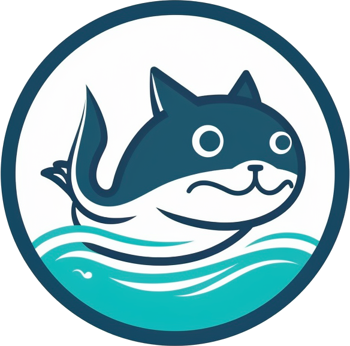

# som



`som` is a command-line utility for interacting with Symfony applications (now I'm working with [API platform](https://api-platform.com/)) running on Docker Compose. It provides a number of useful commands for managing your application and makes it easy to run Symfony, PHP, Composer and Docker Compose commands without manual docker command hassle.

Inspired by Laravel's `sail` tool, `som` aims to provide similar functionality, but designed specifically for Symfony based projects.

## System Requirements
- Docker and Docker Compose
- bash
- jq (optional, for shorthand Composer script commands)

## Installation

`som` is a bash script and does not require any specific installation steps. Just clone or download the script from this repository and place it in your project root.

## Usage

```bash
som COMMAND [options] [arguments]
```

Unknown commands are passed directly to the Docker Compose.

### Docker Compose Commands

- `som up` - Start the application
- `som up -d` - Start the application in the background
- `som stop` - Stop the application
- `som restart` - Restart the application
- `som ps` - Display the status of all containers

### Symfony Console Commands

- `som console ...` - Run a Symfony console command

### PHP Commands

- `som php ...` - Run a PHP snippet
- `som php -v` - Show PHP version

### Composer Commands

- `som composer ...` - Run a Composer command
- `som run ...` - Run a Composer script (equivalent to "composer run")

If you have 'jq' installed and your composer.json has, for example, 'fix' script, you can run:
- `som fix`

If composer.json not in the current dir set COMPOSER_JSON_PATH env

### Running Tests

- `som test` - Run PHPUnit tests via the Artisan test command
- `som phpunit ...` - Run PHPUnit
- `som pest ...` - Run Pest

### Container CLI

- `som shell` - Start a shell session within the application container
- `som bash` - Alias for 'som shell'
- `som root-shell` - Start a root shell session within the application container
- `som root-bash` - Alias for 'som root-shell'
- TODO: `som psysh` - Start a new psysh session

### Binaries

- `som bin ...` - Run Composer binary scripts from the vendor/bin directory

### Help

- `som help` - Show help information

## Environment Variables

Environment variables can be defined in your .env file. The following variables are used by the SOM script:

- `HTTP_PORT`: The HTTP port for your application (default: 80)
- `HTTPS_PORT`: The HTTPS port for your application (default: 443)
- `HTTP3_PORT`: The HTTP3 port for your application (default: 443)
- `DOCKER_PHP_SERVICE`: The Docker service name for PHP (default: "php")
- `DOCKER_DB_SERVICE`: The Docker service name for the database (default: "database")
- `DOCKER_WEB_SERVER_SERVICE`: The Docker service name for the web server (default: "caddy")
- `DB_PORT`: The database port (default: 5432)
- `USER`: The user ID for the Docker container (default: UID of the current user)
- `GROUP`: The group ID for the Docker container (default: GID of the current user)
- `DOCKER_COMPOSE_FILES`: The Docker Compose file paths (separated by a colon if multiple files)
- `COMPOSER_JSON_PATH`: The path to the composer.json file (default: "composer.json")

## Contributing

Contributions are welcome! Please submit a pull request or create an issue to discuss the changes you want to make.